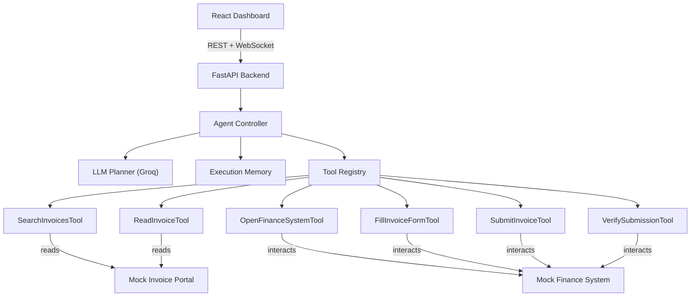

# Autonomous AI Task Worker — Design Decisions

## Architecture Overview



---

## Key Design Decisions

### 1. Custom Agent Loop over LangChain/LangGraph
> The project doc says: *"A custom agent loop can actually make the architecture easier to explain."*

- **Why**: Full control, easier to debug, no hidden abstractions
- **Benefit**: You can explain every line in an interview
- **Extensibility**: Adding a new step to the loop = adding a few lines in `controller.py`

### 2. API-Based Tools instead of Playwright (for prototype)
- **Why**: Our mock apps are our own code, so direct function calls are simpler and more reliable
- **Benefit**: No browser process to manage, faster execution, easier testing
- **Extensibility**: The `BaseTool` interface is identical — swap in Playwright-based tools later without changing the controller

### 3. Groq with OpenAI-Compatible Function Calling
- **Why**: Free tier, fast inference, supports tool/function calling
- **Model**: `llama-3.1-70b-versatile` (strong reasoning, good at tool selection)
- **Extensibility**: Swap to any OpenAI-compatible provider by changing `config.py`

### 4. WebSocket for Real-Time Execution Updates
- **Why**: The UI needs to show each step as it happens
- **Alternative considered**: SSE (simpler) — but WebSocket allows bidirectional communication needed for user approval
- **Extensibility**: Any new event type = add to `EventType` enum

### 5. Modular Tool System with Registry Pattern
- **Why**: Each tool is self-contained with a clear interface
- **Adding a new tool**: Create a file, subclass `BaseTool`, register in the registry
- **No tool knows about any other tool** — they're fully decoupled

### 6. Intentional Failure in Mock Environment
- **Why**: Demonstrates the agent's error recovery (session expiry on first submit)
- **This is the strongest demo point** — shows autonomy, not just scripting

### 7. Pydantic Models for All Data Contracts
- **Why**: Type safety, validation, serialization — all in one place (`agent/models.py`)
- **Extensibility**: Add a field = add it to the model, all serialization updates automatically

### 8. Vanilla CSS with Tailwind
- **Why**: User preference + recommended in project doc
- **Version**: Tailwind v3 (stable, well-documented)

---

## Project Structure

```
AI_Agentworker/
├── backend/
│   ├── main.py                    # FastAPI entry point
│   ├── config.py                  # Configuration (env vars)
│   ├── requirements.txt
│   ├── .env.example
│   ├── agent/
│   │   ├── __init__.py
│   │   ├── models.py              # All Pydantic data models
│   │   ├── memory.py              # Execution state/memory
│   │   ├── planner.py             # LLM integration (Groq)
│   │   └── controller.py          # Core observe-decide-act loop
│   ├── tools/
│   │   ├── __init__.py
│   │   ├── base.py                # BaseTool abstract class
│   │   ├── registry.py            # Tool registry
│   │   ├── invoice_search.py      # Search invoices
│   │   ├── invoice_read.py        # Read invoice details
│   │   ├── finance_open.py        # Open finance system
│   │   ├── finance_fill.py        # Fill invoice form
│   │   ├── finance_submit.py      # Submit invoice
│   │   └── finance_verify.py      # Verify submission
│   ├── mock_env/
│   │   ├── __init__.py
│   │   ├── invoice_portal.py      # Mock invoice data
│   │   └── finance_system.py      # Mock finance system (with failures)
│   └── api/
│       ├── __init__.py
│       └── routes.py              # REST + WebSocket endpoints
├── frontend/                      # Vite + React + Tailwind
│   ├── src/
│   │   ├── App.jsx
│   │   ├── main.jsx
│   │   ├── index.css
│   │   ├── components/
│   │   │   ├── TaskInput.jsx
│   │   │   ├── ExecutionLog.jsx
│   │   │   ├── ResultPanel.jsx
│   │   │   └── ApprovalDialog.jsx
│   │   └── hooks/
│   │       └── useTaskRunner.js
│   └── ...
└── README.md
```

---

## How to Extend

| Want to... | Do this |
|---|---|
| Add a new tool | Create `tools/my_tool.py`, subclass `BaseTool`, register in `routes.py` → `_create_registry()` |
| Add a new mock system | Create `mock_env/my_system.py`, inject into tools |
| Change LLM provider | Update `planner.py` client initialization + `config.py` |
| Add a new event type | Add to `EventType` enum in `models.py` |
| Add a new workflow | The agent handles it naturally — just provide the right tools |
| Add persistent storage | Replace in-memory dicts in `routes.py` with a database |
| Add Playwright | Create Playwright-based tools implementing `BaseTool` |
